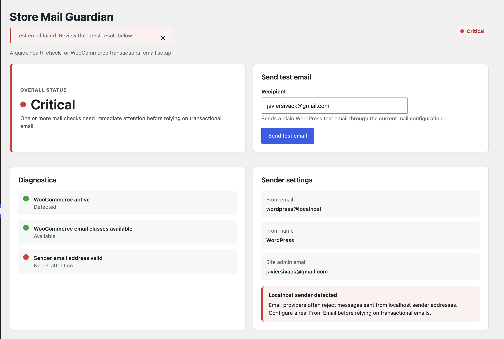
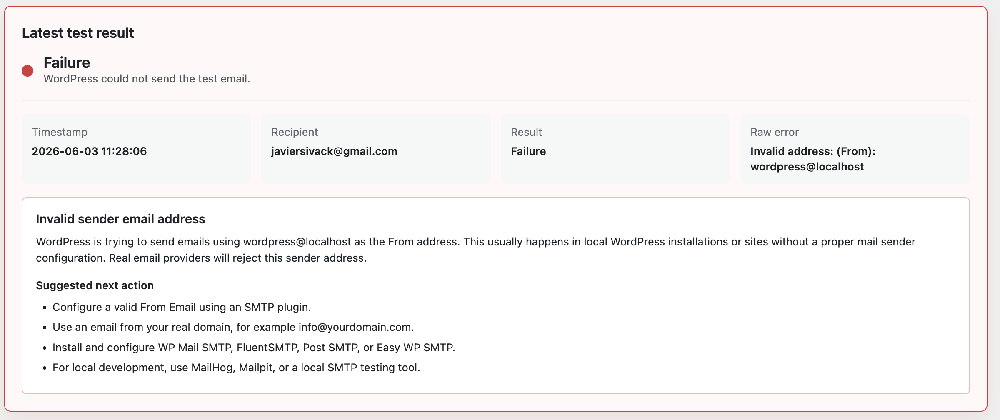

# Store Mail Guardian

Store Mail Guardian is a small WordPress admin plugin that helps WooCommerce store owners spot common transactional email setup problems before customers miss order emails.

## Problem It Solves

WooCommerce stores depend on transactional emails for new orders, customer receipts, password resets, failed order notices, and other critical events. Many WordPress sites still send through the default `wp_mail()` configuration, which can fail because of missing SMTP setup, invalid sender addresses, local development hosts, or hosting mail restrictions.

Store Mail Guardian gives store owners a simple diagnostics screen, a test email tool, and plain-language guidance for common failures such as `wordpress@localhost`.

## Features

- Overall email setup status: Healthy, Warning, or Critical.
- WooCommerce active check.
- WooCommerce email class availability check.
- Enabled WooCommerce email notification listing.
- Current WordPress From Email and From Name diagnostics.
- Sender email validity check, including localhost sender detection.
- Site admin email display.
- SMTP plugin detection for WP Mail SMTP, FluentSMTP, Post SMTP, and Easy WP SMTP.
- Practical warning when no SMTP plugin is active.
- Test email form protected by WordPress nonces and capability checks.
- Latest test result saved with timestamp, recipient, result, raw error, friendly explanation, and suggested next actions.
- No external services, custom tables, or third-party dependencies.

## Screenshots

### Dashboard Overview



### Friendly Error Detection



## Installation

1. Download or clone this repository.
2. Copy the `store-mail-guardian` folder into `wp-content/plugins/`.
3. Activate **Store Mail Guardian** from the WordPress Plugins screen.
4. Open **Mail Guardian** in the WordPress admin menu.

## How To Use

1. Open **Mail Guardian** in WordPress admin.
2. Review the overall status and diagnostics cards.
3. Confirm the From Email, From Name, and site admin email.
4. Check whether a supported SMTP plugin is active.
5. Review enabled WooCommerce email notifications if WooCommerce is installed and active.
6. Send a test email to the site admin email or another inbox you control.
7. Review the latest test result and suggested next actions if the test fails.

## Local Development Notes

- The plugin is intentionally dependency-free and does not require Composer or npm.
- Use a local WordPress install with this folder placed under `wp-content/plugins/`.
- For local email testing, use a tool such as MailHog, Mailpit, or another local SMTP catcher.
- The plugin does not send data to external services.
- PHP syntax can be checked with:

```bash
find store-mail-guardian -name '*.php' -print0 | xargs -0 -n1 php -l
```

## Common Errors Explained

### Invalid address: (From): wordpress@localhost

This means WordPress is trying to send emails using `wordpress@localhost` as the From address. This usually happens in local WordPress installations or sites without a proper mail sender configuration. Real email providers will reject this sender address.

Suggested fixes:

- Configure a valid From Email using an SMTP plugin.
- Use an email from your real domain, for example `info@yourdomain.com`.
- Install and configure WP Mail SMTP, FluentSMTP, Post SMTP, or Easy WP SMTP.
- For local development, use MailHog, Mailpit, or a local SMTP testing tool.

### No SMTP plugin detected

WordPress may still attempt to send email without an SMTP plugin, but transactional emails often fail or land in spam on many hosting environments. Configure a dedicated SMTP plugin or mail provider for production stores.

### WooCommerce is not active

The plugin still loads without WooCommerce, but WooCommerce-specific email notification diagnostics cannot run until WooCommerce is installed and active.

## Current MVP Limitations

- The test email only confirms that WordPress accepted or failed the message. It cannot prove inbox delivery.
- SMTP plugin detection is limited to common plugin slugs.
- No DNS, SPF, DKIM, DMARC, mailbox, bounce, or deliverability checks are performed.
- No external email provider integrations are included.
- Only the latest test email result is stored.
- No custom database tables are created.
- No automated test suite is included yet.

## Roadmap

- Add more SMTP plugin detectors.
- Add optional SPF, DKIM, and DMARC diagnostics.
- Add WooCommerce email settings summaries.
- Add exportable diagnostics report.
- Add PHPUnit coverage for diagnostics and error guidance.
- Add screenshots and release assets.

## Contributing

Contributions are welcome. Keep changes small, focused, and aligned with WordPress coding practices.

Before opening a pull request:

- Run PHP syntax checks.
- Verify the plugin activates without fatal errors.
- Confirm the Mail Guardian admin page loads.
- Test with WooCommerce active and inactive when possible.
- Avoid committing secrets, generated archives, OS files, editor settings, or local logs.

## License

Store Mail Guardian is licensed under GPL-2.0-or-later.
